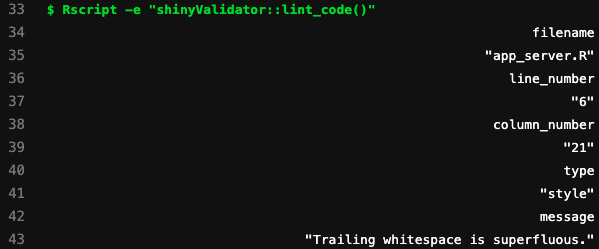

```{r, setup}
library(shinyValidator)
```

```{r, include = FALSE}
knitr::opts_chunk$set(
  collapse = TRUE,
  comment = "#>"
)
```

## Getting started

### Project structure

`{shinyValidator}` requires the Shiny app to belong to a package.
We believe that packages are relevant for a Shiny app:

  - Offers easy __documentation__.
  - Unit-tests.
  - Easier to maintain.
  
`{shinyValidator}` has been built with `{golem}` in mind. 
Particularly, it expects to have these functions:

  - `app_server()`.
  - `app_ui()`.
  - `run_app()`.
  
Under the hood, `{shinyValidator}` brings its own version of `run_app()`, namely `run_app_audit()` to inject various elements necessary to the validation steps. It also automatically creates a CI/CD file template so that the workflow is ready to run on Github Actions or Gitlab CI/CD. Other elements such as a custom `.lintr` file and package suggests are imported to reduce the amount of work you have to do. Finally, a few JavaScript (JS) assets are copied as they are necessary to run the [Monkey](https://en.wikipedia.org/wiki/Monkey_testing) tests, thereby preventing proxy issues from blocking external JS assets in corporate environments.

### Typical setup workflow with {golem}

#### Initialize package

```{r, eval=FALSE}
path <- file.path(tempdir(), "mypkg") 
golem::create_golem(path)
usethis::use_mit_license() # or whatever license
usethis::use_testthat()
usethis::use_test("dummy")
usethis::use_git()
usethis::use_github() # make sure to have a valid GITHUB_PAT
# ...
```

#### Prepare {renv}

Before using `{renv}`, we suggest to create a `.Renviron` file containing:

```shell
RENV_PATHS_LIBRARY_ROOT = ~/.renv/library
```

```r
system("echo 'RENV_PATHS_LIBRARY_ROOT = ~/.renv/library' >> .Renviron")
```

and restart R.

Overall, this options creates the `{renv}` library outside the current Shiny app project folder, which avoids delays during `devtools::check()` and `devtools::build()`.

#### Setting up {renv}
Before initializing `{shinyValidator}`, `{renv}` must be activated in your project. It allows you to properly maintain your dependencies and isolate each project. This way, it prevents from accidentally breaking the code after installing a new package version that could be incompatible with your current code base. While this is more efforts, it is a game changer in the long run. 

```{r, eval=FALSE}
# DaVinci renv
library(renv)

# SCAN the project and look for dependencies
renv::init()

# install missing packages
renv::install("<PACKAGE>")

# Capture new dependencies after package installation
renv::snapshot()
```

As a side note, `{renv}` may also be used during [CI/CD](https://rstudio.github.io/renv/articles/ci.html) (see an example [here](https://github.com/r-lib/actions/tree/a242ddd768e3acf4e8b2e44ad7f345cdbe388a57/setup-renv)). 
To have faster package restoration with `{renv}` during CI/CD, you may
replace the CRAN repository and point to binaries, below for Linux:

```json
"R": {
  "Version": "4.1.0",
  "Repositories": [
    {
      "Name": "CRAN",
      "URL": "https://packagemanager.rstudio.com/all/__linux__/focal/latest"
    }
  ]
}
```

#### {shinyValidator} setup
If your are using Github, don't forget to connect the remote repository 
to the local one before initializing `{shinyValidator}`.

Below shows how to activate `{shinyValidator}`:

```{r, eval=FALSE}
devtools::install_github("Novartis/shinyValidator")
library(shinyValidator)
## At the root of your R package
use_validator("github")
devtools::document() # update help
renv::snapshot()
```
  
`audit_app()` is the main package function. It essentially runs a series of tests based on the predefined parameters or scope:

```{r, eval=FALSE}
audit_app(
  headless_actions = NULL,
  timeout = 5,
  scope = c("manual", "DMC", "POC"),
  workers = 5,
  cran = FALSE,
  vignettes = FALSE,
  error_on = "never",
  output_validation = FALSE,
  coverage = TRUE,
  load_testing = TRUE,
  profile_code = TRUE,
  check_reactivity = TRUE,
  flow = FALSE,
  debug = FALSE,
  ...
)
```

Although primarily meant to be called from CI/CD, it may also run locally, provided
that you have `shinycannon`and a Chrome-based browser. Fortunately, `audit_app()` is able to detect any compatibility issue and accordingly warn you. 

`audit_app()` gives you the flexibility to choose whatever 
level of testing you want. The following code will only enable basic check and linting:

```{r, eval=FALSE}
audit_app(scope = "POC") # Proof of concept
```

At the moment, 3 predefined scopes exist:

  - manual: You have full control on the level of testing you want to apply. This is the default choice. 
  - DMC: setup validation tools for DMC apps (data monitoring committee, an independent group responsible to assess the efficacy and safety for patients in a clinical trial), where testing expectations are very high.
  - POC: setup validation tools for proof of concept apps, where minor testing is required.

### What you still have to do
Even though `{shinyValidator}` offers many helpers, there is still some work to be done, particularly for output validation (plots, htmlwidgets, ...), and testing in general. Importantly, `{shinyValidator}` __will not__ automatically write such tests for you, like unit tests.

As a reminder, to initialize tests in a package, you run:

```{r, eval=FALSE}
usethis::use_testthat() # Init tests folder structure
usethis::use_test("modules") # creates test-module.R
```

#### Note about Shiny server testing

Shiny server function [testing](https://shiny.rstudio.com/articles/server-function-testing.html) consists of simulating a mock session, thereby providing access to reactive values, inputs and outputs, like you would have in a real session. This is very convenient to check how Shiny modules interact together for instance. However, none of this can be automated, which means these tests will have to be written by someone. As an example, assume a Shiny app with this server function:

```{r, eval=FALSE}
app_server <- function(input, output, session) {
  # Your application server logic
  output$distPlot <- renderPlot({
    hist(rnorm(input$obs))
  })
}
```

One can write:

```{r, eval=FALSE}
testServer(app_server, {
  session$setInputs(obs = 0)
  # There should be an error
  expect_error(output$distPlot)
  session$setInputs(obs = 100)
  str(output$distPlot)
})
```

Notice how inputs are set. This is because the test is run without the UI part. Therefore, it is the developer's responsibility to drive the UI.

Important note: if you had to test Shiny modules, server testing only works with the `moduleServer()` API (new API). For instance, let's rewrite the previous server function as a module:

```{r, eval=FALSE}
my_base_hist <- function(id, extra) {
  moduleServer(id, function(input, output, session) {
    # Your application server logic
    output$distPlot <- renderPlot({
      hist(rnorm(input$obs * extra))
    })
  })
}
```

The new test script would be:

```{r, eval=FALSE}
testServer(my_base_hist, args = list(extra = 0), {
  session$setInputs(obs = 100)
  expect_error(output$distPlot)
})
```

We leave the reader refer to the official [documentation](https://shiny.rstudio.com/articles/server-function-testing.html) for further use cases.
 

### Validation overview

In the following, we'll review each validation step.

#### Lint

We believe that a good R project has consistent R style. This is particularly relevant when many people contribute to the same code base. Assuming we all have slightly different preferences, how do we maintain consistency after each commit?

Tools like `{lintr}`, a static code reviewer for R, help doing this with a pretty straightforward API. The first step of the `{shinyValidator}` pipeline utilizes `{lintr}` to quickly analyse the `./R` folder (default):

```{r, eval=FALSE}
shinyValidator::lint_code(paths = "R", tolerance = 0)
```

If you had to check more than one folder, you can pass a vector instead:

```{r, eval=FALSE}
shinyValidator::lint_code(paths = c("R", "tests/testthat"), tolerance = 0)
```

The tolerance is the number or errors to allow, which defaults to 0. We recommend not changing it and play the game!

This function may be called locally and we strongly suggest doing so since it may ease the debugging process (rather than on CI/CD). As shown in the following figure, the lintr found an issue in the `app_server.R` file , line 6 with an extra white space, which has to be removed. 

```{r shinyValidator-lintr, echo=FALSE, fig.cap='Example of linting output during CI/CD.', out.width='75%', fig.align='center'}

```

We strongly encourage to use `{lintr}` at the beginning of a project since the number of errors after 1 year of coding might be important and frustrating to debug. 

If you think that `{lintr}` is too strict, you may fine tune its [behavior](https://github.com/r-lib/lintr#available-linters) by changing the `.lintr` file:

```shell
linters:
  with_defaults(
    line_length_linter = line_length_linter(100),
    infix_spaces_linter = NULL,
    object_usage_linter = NULL,
    object_name_linter = NULL,
    open_curly_linter = NULL,
    commented_code_linter = NULL,
    trailing_whitespace_linter = NULL
  )
```

#### Package check and build

While `{lintr}` analyses R code, `devtools::check()` audits the overall package quality:

- Check that package can be built.
- Check for non standard files/folder.
- Check for correct DESCRIPTION file format.
- Check vignettes.
- Check documentation.
- Run unit tests.
- ...

```{r shinyValidator-rcmdcheck, echo=FALSE, fig.cap='Package check report for {shinyValidator}.', out.width='75%', fig.align='center'}
knitr::include_graphics("figures/shinyValidator-rcmdcheck.png")
```

Pretty much any error may be captured, which ultimately guarantees a high quality project, easy to maintain. Each potential issue is labelled as either NOTE, WARNING or in the worse case ERROR. In general, you don't want to see ERROR nor WARNING. Few NOTES may be tolerated (in theory), although in practice, NOTES are most of the time rejected from CRAN submissions. 

This step is crucial since it ensures global package quality. By default, `{shinyValidator}` will not check vignettes nor CRAN. This may however be customized depending on needs in the
CI/CD file. For instance, in the `./.gitlab-ci.yml`, we can control what parameter to pass to `audit_app()`:

```yaml
auditing:
  stage: audit
  script:
    - Rscript -e 'shinyValidator::audit_app(load_testing = FALSE, profile_code = FALSE, check_reactivity = FALSE, coverage = FALSE);'
  artifacts:
    paths:
      - public
    expire_in: 30 days
```

For GitHub Actions, you'll have to modify the `.github/workflows/shiny-validator.yaml` file:

```yaml
- name: Audit app 🏥
  shell: Rscript {0}
  run: shinyValidator::audit_app() # Customize here ...
```

`{shinyValidator}` automatically generate a coverage report (See [{covr}](https://covr.r-lib.org/)), which gives a rather good idea of the code testing state.

```{r shinyValidator-coverage, echo=FALSE, fig.cap='Coverage report available in {shinyValidator}', out.width='75%', fig.align='center'}

```

#### Crash test

If the two previous steps ensure global code quality, it does not check whether the application starts properly and remains alive after basic usage. 

This is where the crash test comes to play. It first:

  - Checks whether the app starts.
  - Manipulates the app and checks if it remains alive after some time.
  
This step leverages R subprocesses, the idea being to start the app on a child process, connect to the app with a [headless](https://developers.google.com/web/updates/2017/04/headless-chrome) web-browser (without display). The `run_crash-test()` function has two parameters:

  - __headless_actions__: required if you want to provide custom instructions to manipulate the app with a headless browser. By default, `{shinyValidator}` performs a [Monkey test](https://engineering-shiny.org/build-yourself-safety-net.html#testing-the-interactive-logic) (see also [here](https://github.com/marmelab/gremlins.js/blob/master/README.md)), which consists of triggering random events on the app such as clicks, scroll, input change, ... for 10 seconds. 
  - __timeout__: if the app takes time to load, you have to adjust this value.
  - __...__: to pass any parameter to `run_app_audit()`.

```{r, eval=FALSE}
shinyValidator::run_crash_test(headless_actions = NULL, timeout = 5)
```

In the following screenshot, since the app is not particularly complex (there is only one slider input), there is no need for a Monkey test. Therefore, we start the app and change the slider input value to 200. This requires to pass a __headless_actions__ parameter. As `{shinyValidator}` relies on `{shinytest2}`, we rely on the `set_inputs` method to manipulate the slider:

```{r, eval=FALSE}
# app refers to the headless app instance.
shinyValidator::run_crash_test({
  app$set_inputs(obs = 30)
  app$get_screenshot("plop.png")
  # ... pass any other commands from shinytest2 API
})
```

Then, we can modify the `./.gitlab-ci.yml` file to account for this new element:

```yaml
auditing:
  stage: audit
  script:
    - Rscript -e 'shinyValidator::audit_app(headless_actions = custom_horde);'
  artifacts:
    paths:
      - public
    expire_in: 30 days
```

```{r shinyValidator-crashtest, echo=FALSE, fig.cap='Crash test. Left: a snapshot is taken after initial app loading. Right: app undergo some usage, another snapshot is taken.', out.width='75%', fig.align='center'}

```

#### Output validation

During CI/CD, `{shinyValidator}` runs a global output snapshot comparison to check whether the current commit shows similar results as the current snapshot (as a reminder, you have to initialize a first snapshot locally, which will server as reference for future comparison). This however requires to have predefined tests, for instance in `test-basic-plot.R` for a static base plot (work similarly for `{ggplot2}`):

```{r, eval=FALSE}
make_hist <- function(val) {
  hist(rnorm(val))
}
test_that("Base plot OK", {
  set.seed(42) # to avoid the test from failing due to randomness :)
  vdiffr::expect_doppelganger("Base graphics histogram", make_hist(500))
})
```

and `test-echarts4r.R` for an `{echarts4r}` powered graph (htmlwidget): 

```{r, eval=FALSE}
test_that("echarts4r ok", {
  snapshot_widget <- function(path) {
    htmlwidgets::saveWidget(make_echart("Income"), path)
    path
  }
  
  expect_snapshot_file(snapshot_widget("tmp_echarts_plot.html"), "echarts_plot.html")
})
```

Don't forget to account for random number generation if you are using `rnorm` for instance.
Whenever you modify the app, you have to run `devtools::test()` locally to create snapshots of the plots. If any difference is detected, the test will fail: 

```shell
x |   0 1     | basic-plot [0.1 s]                       
─────────────────────────────────────────────────────────
Failure (test-basic-plot.R:3:3): Base plot OK
Snapshot of `testcase` to 'basic-plot/base-graphics-histogram.svg' has changed
Run `testthat::snapshot_review('basic-plot')` to review changes
Backtrace:
 1. vdiffr::expect_doppelganger("Base graphics histogram", make_hist(500)) test-basic-plot.R:3:2
 3. testthat::expect_snapshot_file(...)

[...]
══ Results ══════════════════════════════════════════════
Duration: 33.0 s

[ FAIL 3 | WARN 1 | SKIP 0 | PASS 1 ]

Keep trying!
```

`{shinyValidator}` displays a visual widgets (based on `{diffviewer}`) for each detected snapshot difference, allowing the developer to compare the current outputs to reference snapshot. It is the developer's responsibility to decide whether to accept the changes. This may be done locally with:

```{r, eval=FALSE}
testthat::snapshot_review('basic-plot')
```

```{r shinyValidator-output-validation, echo=FALSE, fig.cap='Output validation example. Left: static plot. Right: htmlwidget data.', out.width='75%', fig.align='center'}

```

### Performance audit

The following tests are not as important as the app validation. Yet, if you want to offer optimized user experience, they are of great help.

#### Load test

A load test consists of checking whether a Shiny app handles multiple concurrent users without suffering from major performance issues. To the best of our knowledge, there is currently only one package allowing to audit Shiny apps load, that is [{shinyloadtest}](https://rstudio.github.io/shinyloadtest/). 

A load tests is composed of 3 steps:

  - The end user (or the developer) records a realistic user session.
  - This session is replayed in parallel to simulate simultaneous users.
  - Results are analyzed.
  
From a technical point of view, there are 2 pieces of software:

  - `{shinyloadtest}` provides the session recorder, stores logs and returns an HTML report.
  - __shinycannon__ is a cli tool that replays sessions in parallel.
  
In theory, the recording step is manual. However, it is entirely possible to automate it with a headless web-browser. The idea being to provide a realistic set of instructions to manipulate the app. This is usually the trickiest part, but tools like the `{shinytest}2` recorder can generate the replay [script](https://rstudio.github.io/shinytest/articles/in-depth.html). `{shinyValidator}` offers both approaches with the `record_app()` function:

```{r, eval=FALSE}
shinyValidator::record_app(headless_actions = NULL, timeout = 5, workers = 5, ...);
```

__workers__ corresponds to the number of parallel sessions replayed by `shinycannon` in the background. __timeout__ is the time taken the the app to be ready and __headless_actions__ is a parameter to provide custom manipulations with the `{shinytest2}` API. 

In the following screenshot, we still play with the same demo app having only one slider input.
The app is started locally on a R subprocess, then we connect the `{shinyloadtest}` recorder. We manipulate the app with the headless browser. The recorder is stopped as well as the headless browser and `shinycannon` replays the app (this is the longest part, depending on the number of workers).

```{r shinyValidator-loadtest-cicd, echo=FALSE, fig.cap='Load test during CICD', out.width='75%', fig.align='center'}

```

At the end, an HTML report with relevant results is generated. Overall, the blue area represent calculations. Ultimately, you want to see as less blue area as possible, compared to the grey area (time the app is resting). We leave the reader fallback to the official `{shinyloadtest}` [documentation](https://rstudio.github.io/shinyloadtest/articles/analyzing-load-test-logs.html) to get a thorough overview of load testing interpretation. 

```{r shinyValidator-loadtest-report, echo=FALSE, fig.cap='Load test HTML report', out.width='75%', fig.align='center'}
knitr::include_graphics("figures/shinyValidator-loadtest-report.png")
```

As a side note, if you ever see this error during the load-test:

```shell
load-test - HTTP Latency [====>----------------------------------------------------------] 2/26 eta: 
0sError in svglite_(filename, bg, width, height, pointsize, standalone,  : 
  Graphics API version mismatch
```

This is a known [issue](https://github.com/r-lib/svglite/issues/71). 
Reinstall `{svglite}` from source:

```{r, eval=FALSE}
install.packages("svglite", type = "source")
```

#### Reactivity analysis

`{shiny}` is built on top the reactive programming concept. While it has many advantages (like caching), it is fairly straightforward to get lost in the reactive inferno, leading to very unstable apps. 

Have you already experienced situations where a reactive expression did not update, an output did not react to the related input change or a reactive expression changed when a supposedly non-related input was changed? Don't lie. I am sure you did ...

`{reaclog}` is the tool you were looking for. It offers a network representation of the app reactivity, allowing to quickly identify potential issues. The reader will refer to the comprehensive guide [here](https://rstudio.github.io/reactlog/articles/reactlog.html#reactlog-in-detail-1).

In the background, `{shinyValidator}` automatically starts the app in the background, wait for Shiny to be available, stops the app and returns the reactlog object. The reactlog is in turn exported as a standalone HTML widget to be included in the validation report, as shown below. You may fine tune the __timeout__ parameter to account for the app loading duration and also add custom manipulation through __headless_actions__:

```{r, eval=FALSE}
shinyValidator::upload_reactlog(headless_actions = NULL, timeout = 5, ...);
```

In the below output, we notice an isolated output. This is generally an issue, meaning that something was hard coded in the code. Here, we deliberately removed the input feeding into the echarts plot causing this strange pattern. 

```{r shinyValidator-reactlog, echo=FALSE, fig.cap='Shiny app reactivity graph. We see one output is not linked to any input. This is likely an issue. ', out.width='75%', fig.align='center'}

```

#### Code profiling

Finally, in addition to the load test, it is good to have an idea of how much time your R code takes to run in the Shiny app, especially if you planned to provide some [optimization](https://engineering-shiny.org/need-for-optimization.html). For instance, this might help to understand why there are many blue areas in the load test report. 

`{shinyValidator}` leverages the `{profvis}` R package to audit the Shiny app starting time. The app is also started in the background, a headless connection is then established and closed, which subsequently terminate the `{profvis}` recorder. Like for the previous tests, it is possible to fine tune the app actions by passing them within __headless_actions__.

We leave the reader to review the `{profvis}` [documentation](https://rstudio.github.io/profvis/) to get a better understanding of the report. Overall, as shown in the following figure, the left panel displays the time and memory taken by each code block. On the right side is a flame graph to explore the call stack in depth. Display options may be changed in the top right corner. 

```{r shinyValidator-profile, echo=FALSE, fig.cap='Shiny app profiling at start.', out.width='75%', fig.align='center'}
knitr::include_graphics("figures/shinyValidator-profile.png")
```
